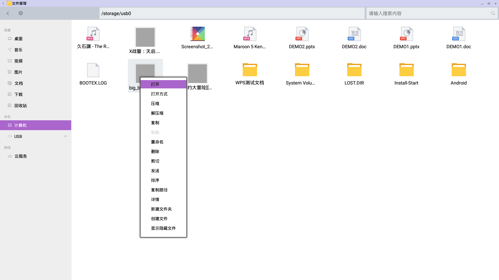

#VLC使用说明书

##VLC效果图
- 

## VLC功能点

   - 1 点击左上角图标，可以查看软件的功能结构
   
    
        
   - 2 选择视频项，会自动搜索本机的视频，并且显示出来
   
    

   - 3 点击展示出来的视频列表，可以进入视频播放
   
   

   - 4 点击音频项，会自动搜索本机的音频文件，并且展示出来
   
   
   
   - 5 点击目录项，可以进入本地自己选择视频路径
   
   
   
   - 6 例如，查找本地movies下的文件，可以通过点击目录，找到movie查找到以后点击可以播放
   
   
   
   - 7 点击本地网络项，可以查看本地网络的视频
   
   ！[](https://github.com/openthos/app-testing-results/blob/master/IMGview/vlc_pic/net.png)
   
   - 8 点击流，可以通过输入视频的地址来观看网络上的图片
   
   
   
   - 7 点击本地网络，可以查看本地网络的视频
   
   
   
   - 7 点击本地网络，可以查看本地网络的视频
   
   
   
   
- 点击VLC打开（出现视频窗口）  

##选择视频音频播放  

  
直接在文件管理器中选择多媒体文件,右击->打开,就可以选择使用VLC播放  
当存在多个多媒体播放软件时,您可以自由选择播放器  

##添加到播放列表


1.VLC在启动时会自动扫描本地的多媒体文件  
2.在"设置"->"选择要收录与媒体库的目录"添加新的目录,下面就会扫描所选的目录  

##本地网络  

VLC会自动扫描局域网上的smb共享文件夹,你可以选择相应的多媒体文件播放;
** 还没有深入测试 **

## 流播放

  
可以添加远程的多媒体链接,VLC会利用http或rtsp协议来获取多媒体文件.  
**具体的链接协议还没有深入测试**  

##音频播放功能  

 音频播放中支持按照"艺术家","专辑","歌曲","流派","播放列表"进行排序分类功能  
 **其中各个列表的"追加"功能不正常.**

##视频格式
目前视频格式支持：
```
mpg，mp4,vob,avi,swf 3gp,mpeg4  
```
待确认格式： 
```
rmvb,wmv,mkv,flv  
```
