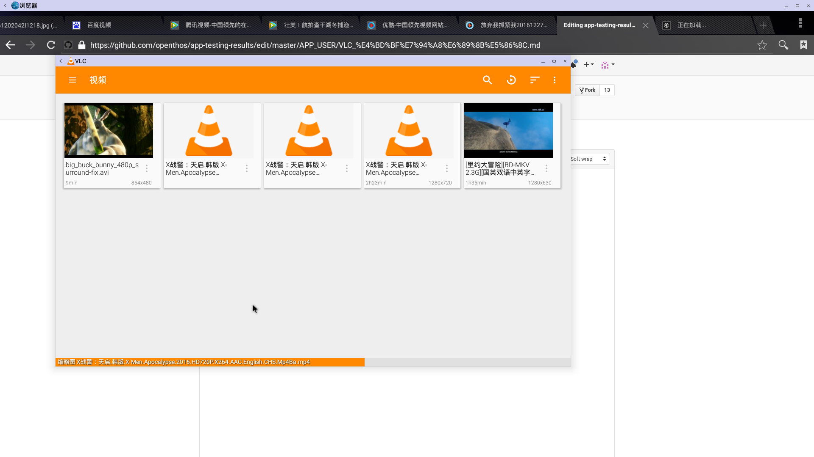
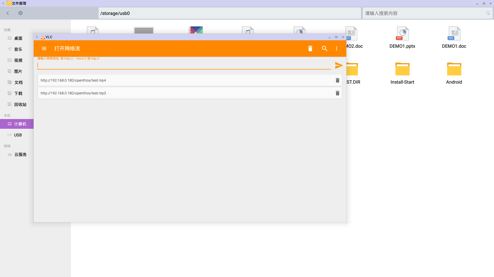

#VLC使用说明书

##VLC效果图
- 

##VLC使用方法
- 点击VLC打开（出现视频窗口）

- 自动添加本地多媒体文件到视频列表  
  1.VLC在启动时会自动扫描本地的多媒体文件  
  2.在"设置"->"选择要收录与媒体库的目录"添加新的目录  
- 视频播放  
  可以直接点击视频列表中的项
  
  也可以在filemanager中直接打开,如上图
- 音频播放  
 打开方式和视频播放雷同;  
 音频播放中支持按照"艺术家","专辑","歌曲","流派","播放列表"进行排序分类功能  
 其中各个列表的"追加"功能不正常.  
- 流播放  
  
可以添加远程的多媒体链接,VLC会利用http或rtsp协议来获取多媒体文件.  
可以正常播放  
- 播放格式  
目前视频格式支持：
```
mpg，mp4,vob,avi,swf 3gp,mpeg4  
```
待确认格式： 
```
rmvb,wmv,mkv,flv  
```
- 点击视频播放
- 点击左上方列表可以查看其他目录
